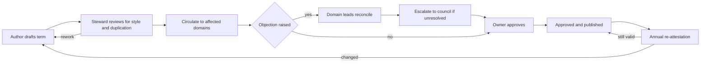

# Business Glossary Template

**A business glossary exists to settle arguments about meaning. It is not an inventory of your columns.**

If two teams report a different number for the same word, that is a glossary problem. If nobody can find which table holds the number, that is a catalogue problem. Conflating the two is the single most common reason glossary programmes stall: the team starts documenting 40,000 columns, discovers nobody reads it, and quietly stops.

This document gives you the anatomy of a term, the rules for writing definitions that survive review, an approval workflow, a copyable template, and a way to seed a glossary in weeks rather than years.

---

## 1. Glossary vs data dictionary vs metric vs report field

These four artefacts get merged into one spreadsheet and the result serves none of them. Keep them distinct and relate them explicitly.

| Aspect | Glossary term | Data element (dictionary) | Metric / measure | Report field |
|---|---|---|---|---|
| **Answers** | What do we mean by this word? | What is stored, where, in what format? | How is this number calculated? | What is this label on this screen? |
| **Owned by** | Business owner or steward | System or platform owner | Metric owner (business) | Report owner |
| **Example** | *Active Client* | `crm.client.status_cd CHAR(2)` | *Active Client Count, month end, EMEA* | "Clients (Active)" on page 2 |
| **Changes when** | The business changes its mind | The schema changes | The calculation or grain changes | The layout changes |
| **Grain** | None — it is a concept | Column-level | Explicit: entity, time, filter | Instance of a metric |
| **Has a formula** | No | No | Yes, always | Inherits one |
| **Lives in** | Glossary | Catalogue / schema registry | Metric layer or glossary as a metric-type asset | BI tool |
| **Typical count** | Hundreds | Tens of thousands | Hundreds | Thousands |

**The rule that keeps them apart:** a glossary term has no formula and no grain. The moment you write "sum of" or "as at month end", you are defining a metric, not a term. Model metrics as their own asset type that *relates to* the term. *Active Client* is a term; *Active Client Count* is a metric that uses it.

Two more distinctions worth policing:

- **A term is not a synonym for a column.** One term may map to zero physical columns (it is a concept the business uses but nothing stores), or to eleven across five systems.
- **A term is not a policy.** "Client data must be retained for seven years" is a policy statement. The term *Client Data* is what the policy points at.

---

## 2. Anatomy of a term

Every field below earns its place. If you cannot say what a field is for, drop it — empty attributes train people to ignore the glossary.

| Field | Required | Purpose | Notes |
|---|---|---|---|
| `name` | Yes | The word itself | Singular noun phrase, business language, no acronyms in the name |
| `definition` | Yes | What it means | 1–3 sentences, circular-free, no formula |
| `abbreviation` | No | Common short form | `AUM`. Searchable alias, not the name |
| `synonyms` | No | Words used for the same concept | Drives search recall |
| `not_to_be_confused_with` | No | Near-miss terms | The highest-value field in a mature glossary |
| `owner` | Yes | Accountable for the meaning | A named business role, not a team mailbox |
| `steward` | Yes | Maintains it day to day | May differ from owner |
| `status` | Yes | Lifecycle state | See §3 |
| `effective_from` / `effective_to` | Yes / No | When this meaning applies | Meaning changes are *versioned*, not overwritten |
| `examples` | Yes | Concrete instances that qualify | At least two |
| `counter_examples` | Yes | Instances that do **not** qualify | At least one. This is where ambiguity dies |
| `ambiguity_note` | No | Known disagreement and how to resolve it | Better to document the disagreement than pretend it is settled |
| `related_terms` | No | Typed relations to other terms | See below |
| `physical_mappings` | No | Where it is realised in data | System, dataset, column, plus a note on fidelity |
| `sensitivity` | Yes | Classification driving access and handling | Aligns to your enterprise scheme |
| `domain` | Yes | Which data domain owns it | Drives routing of approvals |
| `source_authority` | No | External standard or regulation it derives from | Cite the standard, not an internal document |
| `review_cycle` | Yes | How often it must be re-attested | Annual is a common starting point |

### Typed relations, not a bag of links

An untyped "related terms" list becomes noise. Use a small, fixed set of relation types — most catalogue tools (Collibra included) model these as named relation types between assets, so pick the ones your tool supports and stop there:

| Relation | Meaning | Example |
|---|---|---|
| `is_a` | Specialisation | *Institutional Client* `is_a` *Client* |
| `part_of` | Composition | *Settlement Date* `part_of` *Trade Lifecycle* |
| `governs` | Policy or rule applies to term | *Client Data Retention Policy* `governs` *Client* |
| `calculated_from` | Metric depends on term | *Net New Assets* `calculated_from` *Inflow*, *Outflow* |
| `replaced_by` | Deprecation pointer | *Client Tier* `replaced_by` *Client Segment* |
| `contrasts_with` | Deliberate near-miss | *Trade Date* `contrasts_with` *Settlement Date* |

### Sensitivity classification belongs on the term

Classifying at column level alone means every new column starts unclassified. Classify the *concept* once, then propagate the classification to physical assets through the mapping. That is what makes classification scale, and it is why the term-to-column relation is worth the effort to maintain.

---

## 3. Status lifecycle

```text
  draft ──▶ proposed ──▶ approved ──┬──▶ deprecated ──▶ retired
    ▲           │                   │
    └───────────┘                   └──▶ (revision) ──▶ proposed
      returned for rework
```

| Status | Who sets it | What it means in practice | Visible to business users? |
|---|---|---|---|
| `draft` | Author / steward | Being written. No commitments. | No |
| `proposed` | Steward | Submitted for review. Circulated to affected domains. | Read-only, flagged |
| `approved` | Approver (domain owner or council) | Authoritative. Safe to cite in a report or contract. | Yes |
| `deprecated` | Owner | Still resolvable for historic reports; must not be used in new work. `replaced_by` is mandatory. | Yes, with a banner |
| `retired` | Owner | Removed from active use. Kept for audit only. | Archive only |

**Never delete a term.** Someone's report from three years ago cites it. Deprecate, point at the replacement, keep the record.

**Deprecated terms must carry a replacement pointer or a reason.** A deprecated term with neither is worse than no term, because the reader learns nothing about what to do instead.

---

## 4. Rules for writing definitions that survive review

Nine rules. Most rejected definitions break rule 1 or rule 3.

1. **No circularity.** The definition must not use the term or its root words.
2. **No formula.** If it contains "sum", "count", "divided by" or a date filter, it is a metric.
3. **Define the concept, not the system behaviour.** "A client with `status_cd = 'A'`" describes a column, not a meaning.
4. **State the boundary.** What is excluded is as important as what is included.
5. **Business language.** If a business reader needs an engineer to interpret it, rewrite it.
6. **One concept per term.** "Client or prospect" is two terms.
7. **Present tense, declarative.** No "will be", no "should be".
8. **No proper nouns for internal systems.** Systems are replaced; meanings persist. Put the system in `physical_mappings`.
9. **Testable.** A reader must be able to take an instance and decide yes or no.

### Before and after

**Example 1 — circularity**

> ❌ **Active Client:** A client who is active.

> ✅ **Active Client:** A client relationship with at least one funded account holding a non-zero balance, that has not been formally closed or transferred away. Dormancy does not remove active status; formal closure does.

*Why it works:* it gives a test a reader can apply, and it names the edge case (dormant) explicitly.

---

**Example 2 — system behaviour masquerading as meaning**

> ❌ **Mandate:** A record in the mandate table where `mandate_type` is not null and `active_flag = 'Y'`.

> ✅ **Mandate:** A formal instruction from a client that authorises the firm to manage a defined pool of assets according to an agreed set of investment objectives, constraints and permitted instruments. A mandate is the unit at which investment discretion is granted; it may span multiple accounts.

*Why it works:* it survives the replacement of the system holding it. Put the table reference in `physical_mappings` where it belongs.

---

**Example 3 — formula smuggled into a term**

> ❌ **Net New Assets:** Total inflows minus total outflows for the period, excluding market movement, reported monthly in base currency.

> ✅ **Net New Assets:** The change in client assets over a period that results from client-driven money movement rather than from market performance. Contributions and new mandates increase it; redemptions and terminations decrease it. Valuation changes are excluded by definition.
>
> *(The monthly, base-currency, period-end calculation is the metric* Net New Assets — Monthly*, which relates to this term.)*

*Why it works:* the term now serves every reporting frequency and currency instead of hard-coding one.

---

**Example 4 — vagueness that survives because nobody objects**

> ❌ **Client Segment:** A grouping of clients used for reporting and analysis.

> ✅ **Client Segment:** The single classification assigned to a client that reflects the servicing model and commercial relationship the firm operates for them — for example the distribution channel, the sophistication category and the servicing tier. Each client carries exactly one segment at a point in time; segment changes are effective-dated and do not restate history.

*Why it works:* it establishes cardinality (exactly one), temporality (effective-dated) and restatement behaviour. Those three properties cause most downstream disputes.

---

**Example 5 — two concepts in one term**

> ❌ **Trade Date:** The date the trade happened or settled, depending on the reporting context.

> ✅ **Trade Date:** The date on which the parties agree the terms of a transaction and the economic exposure changes hands, irrespective of when cash and securities are exchanged.
>
> ✅ **Settlement Date:** The date on which the exchange of cash and securities for a transaction is completed and ownership transfers formally. Contrast with *Trade Date*, which is when the transaction is agreed.

*Why it works:* splitting into two terms with a `contrasts_with` relation is nearly always the right answer when a definition contains "depending on".

---

### The review test

Before you accept a definition, run it past these four questions. If any answer is "no", send it back.

- [ ] Could someone outside the authoring team apply this to a real record and get the same answer?
- [ ] Does it avoid every word in the term name?
- [ ] Does it exclude something explicitly?
- [ ] Would it still be correct if the underlying system were replaced tomorrow?

---

## 5. Approval workflow

Keep the number of states small and the SLAs published. A workflow nobody can predict is a workflow people route around.



| Step | Role | Suggested SLA (calibrate to your volume) | Escalation |
|---|---|---|---|
| Style and duplicate check | Steward | 3 working days | Governance lead |
| Cross-domain circulation | Affected domain leads | 10 working days, silence = no objection | Governance lead |
| Objection reconciliation | Domain leads | 10 working days | Data governance council |
| Approval | Domain owner | 5 working days | Council |
| Publication | Automated on approval | Same day | — |

**Silence must equal consent, with a published window.** Otherwise one unresponsive reviewer blocks the queue indefinitely, and the programme's credibility goes with it. Record who was notified and when — that record is what makes silence defensible.

If your platform supports configurable workflows (Collibra's workflow engine is the common case), implement this as a workflow with explicit responsibilities on the domain rather than as email. The value is not automation for its own sake; it is that the approval record becomes queryable, so you can answer "how many terms are stuck, and with whom" without asking anyone.

---

## 6. Governance of change

A term's meaning changing is a *business event*, not an edit.

| Change type | Example | Who proposes | Who approves | Impact analysis required |
|---|---|---|---|---|
| Editorial | Typo, clearer wording, same meaning | Anyone | Steward | No |
| Additive | New synonym, new example, new mapping | Steward | Steward | No |
| Scope change | Definition now includes or excludes a population | Owner or domain lead | Domain owner + affected domains | **Yes** |
| Deprecation | Term replaced or no longer used | Owner | Domain owner | **Yes** |
| Reclassification | Sensitivity level changes | Steward or privacy function | Domain owner + privacy | **Yes** |

### Impact analysis before a scope change

Before approving a scope change, produce this list. If you cannot produce it, your term-to-asset relations are not maintained well enough to be making the change.

- [ ] Metrics with a `calculated_from` relation to the term
- [ ] Reports and dashboards citing those metrics
- [ ] Data quality rules referencing the term or its mapped columns
- [ ] Policies with a `governs` relation to the term
- [ ] Downstream datasets whose lineage includes the mapped columns
- [ ] Contracts, client communications or regulatory returns using the term
- [ ] Named owners of each of the above, notified with the effective date

**Effective-date every scope change.** A change to *Active Client* that silently restates two years of history destroys trust faster than a wrong definition. State whether prior periods restate, and if so, publish the before-and-after series.

---

## 7. Anti-patterns

| Anti-pattern | What it looks like | Why it happens | The fix |
|---|---|---|---|
| **Glossary as dumping ground** | 8,000 terms, most auto-loaded from column names | Someone measured success by term count | Delete or archive anything without an owner and a business consumer. Measure coverage of what matters, not volume |
| **Term proliferation** | *Client*, *Customer*, *Account Holder*, *Counterparty* as four unreconciled terms | No duplicate check at intake; domains work in isolation | Mandatory duplicate search at draft; a term is only created if the steward can state how it differs from the nearest existing term |
| **Definitions written by IT alone** | Definitions full of table and column names | Business owners were "too busy"; engineers filled the gap | Engineers draft, the business owner *speaks the definition out loud* in review. If they cannot, it is not approved |
| **The glossary nobody maintains** | Last-modified dates two years old; approvers have left the firm | No review cycle, no consequence for staleness | Annual re-attestation with an owner-level report of overdue terms; auto-flag terms whose owner is no longer active |
| **Perfect-first-time paralysis** | Nine months of workshops, zero published terms | Fear of publishing something contestable | Publish `proposed` terms and let disagreement surface. A contested term in the open beats a perfect term in a drawer |
| **Glossary disconnected from data** | Beautiful definitions, zero physical mappings | Mapping is unglamorous and takes engineering time | Make at least one physical mapping mandatory for `approved` status where a physical realisation exists |
| **Metric definitions hidden in BI tools** | Same metric calculated three ways in three dashboards | No metric asset type; BI developers define locally | Model metrics as first-class assets with owners and formulas |

---

## 8. Copyable term template

```yaml
# Copy this block, fill it in, submit as `status: draft`.
- term: ""                          # Singular business noun phrase. No acronyms here.
  abbreviation: ""                  # Optional. e.g. AUM
  definition: >
    ""                              # 1-3 sentences. No formula, no circularity,
                                    # no internal system names. State the boundary.
  domain: ""                        # Owning data domain
  owner: ""                         # Accountable business role
  steward: ""                       # Day-to-day maintainer
  status: draft                     # draft | proposed | approved | deprecated | retired
  effective_from: "YYYY-MM-DD"
  effective_to: null
  version: 1

  synonyms: []                      # Words the business uses for the same concept
  not_to_be_confused_with: []       # Near-miss terms. High value — fill this in.

  examples:                         # At least two instances that qualify
    - ""
    - ""
  counter_examples:                 # At least one instance that does NOT qualify
    - ""

  ambiguity_note: >
    ""                              # Optional. Known disagreement + how to resolve it.

  related_terms:
    - relation: is_a                # is_a | part_of | governs | calculated_from |
      target: ""                    # replaced_by | contrasts_with

  physical_mappings:                # Where the concept is realised. Empty is valid.
    - system: ""
      dataset: ""
      column: ""
      fidelity: exact               # exact | approximate | partial
      note: ""

  sensitivity: internal             # public | internal | confidential | restricted
  source_authority: ""              # External standard or regulation, if any
  review_cycle: annual
  last_reviewed: "YYYY-MM-DD"
```

A worked set of terms using this schema is in [`example-glossary.yaml`](example-glossary.yaml).

---

## 9. Seeding a glossary without boiling the ocean

Do not start from the data. Start from the numbers people argue about in front of executives, and work backwards.

### The method

1. **Collect the executive reporting pack.** Whatever goes to the board, the exec committee and the regulator. Typically 3–8 documents.
2. **Extract every distinct metric.** Expect 40–120 in a large firm; you are targeting the top 20 by prominence.
3. **For each metric, list the nouns it depends on.** *Net New Assets* depends on *Client*, *Mandate*, *Inflow*, *Outflow*, *Valuation*. Those nouns are your first terms.
4. **De-duplicate the noun list.** Twenty metrics typically collapse to 25–40 distinct terms. This is your seed set.
5. **Find the owner by finding who gets challenged.** Whoever has to answer when the number is questioned in the room is the de facto owner. Confirm it with them.
6. **Draft, circulate, publish as `proposed`.** Do not wait for approval to publish.
7. **Map each term to at least one physical column.** This is where you discover the same metric is sourced three different ways.
8. **Only then expand** — to the next tier of reporting, to regulatory returns, to operational domains.

### Why top-down works

Executive metrics have three properties that make them the ideal seed: someone senior already cares, disagreements are already visible, and physical mappings already exist because the number is already being produced. Bottom-up column harvesting has none of these — it produces volume without consumers.

### A realistic first-90-days shape

Treat these as calibration points, not targets. Adjust to your team size and domain complexity.

| Milestone | Rough timing | Done means |
|---|---|---|
| Executive metric inventory complete | Week 2–3 | Every metric in the pack listed with the report it appears on |
| Seed noun list de-duplicated | Week 4 | 25–40 candidate terms with a proposed owner each |
| Owners confirmed | Week 6 | Each term has a named person who has agreed in writing |
| First terms published as `proposed` | Week 7–8 | Visible to the business, comment channel open |
| First contested term escalated and resolved | Week 9–11 | You have exercised the escalation path once, on purpose |
| First cohort `approved` | Week 12 | 15–25 approved terms with physical mappings |

**Deliberately escalate one contested term early.** An escalation path that has never been used does not exist. Pick a genuine disagreement, run it through the council, and publish the outcome — that single event teaches the organisation more about how governance works than any amount of communication material.

### What to do about the long tail

You will not define 40,000 columns and you should not try. The long tail is served by the catalogue, not the glossary: searchable technical metadata, an owner, and a link to the nearest governed term. Terms earn their place by being contested, cited externally, or carrying a policy. Everything else is a column with a description.

---

## Related

- [`example-glossary.yaml`](example-glossary.yaml) — worked terms using this schema
- [`../stewardship/operating-model.md`](../stewardship/operating-model.md) — who owns and approves
- [`../stewardship/raci-template.md`](../stewardship/raci-template.md) — glossary term lifecycle RACI
- [`../metrics/cdo-kpi-framework.md`](../metrics/cdo-kpi-framework.md) — measuring glossary coverage without vanity metrics
