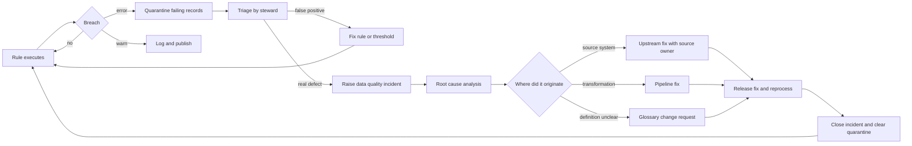

# Data Quality Rule Catalogue

**A rule that nobody owns is a report. A rule with an owner and a consequence is a control.**

This is a catalogue of reusable data-quality rules you can lift into whatever engine you run — a platform's native expectations framework, a catalogue tool's rule engine, or plain SQL in your pipeline. Rule ids are stable so you can reference them in an issue register and in a RACI.

The six dimensions used here are the classic set. **Be honest that taxonomies vary**: DAMA-DMBOK discusses a broader set including reasonableness, integrity and precision; ISO 8000 and various regulatory frameworks slice it differently; some vendors ship four dimensions and some ship fourteen. Nothing important depends on which taxonomy you pick — what matters is that a rule is classified consistently, so that "we have a completeness problem" means the same thing to everyone. Pick one taxonomy, publish it, stop debating it.

**Notation.** SQL examples use `:param` for rule parameters and assume the rule returns *failing rows*. Severity is the typical starting point, not a mandate — §8 covers how to set it.

---

## 1. Completeness

**What it means.** The data that should be present is present. Not "the column is populated" — that is the mechanical test. The real question is whether every record that ought to exist does exist, and every attribute that ought to be known is known.

**How it fails in practice.** A source system makes a field optional for a user group; a feed drops a partition and nobody notices because the job succeeded; a join silently discards rows; a defaulting rule fills nulls with a placeholder so the null check passes while the data is still absent. That last one is the most damaging, because it converts a visible gap into an invisible one.

| Rule ID | Rule name | What it checks | Typical parameters | Example | Severity |
|---|---|---|---|---|---|
| `DQ-CMP-001` | Mandatory attribute populated | A required column is never null | column, scope filter | `SELECT * FROM :t WHERE :col IS NULL` | error |
| `DQ-CMP-002` | Conditional mandatory | Column required only when a condition holds | column, condition | `WHERE country_cd = 'US' AND tax_id IS NULL` | error |
| `DQ-CMP-003` | Blank and whitespace | Field populated but semantically empty | column | `WHERE TRIM(:col) = ''` | error |
| `DQ-CMP-004` | Placeholder detection | Defaulted junk masking absence | column, token list | `WHERE UPPER(:col) IN ('N/A','UNKNOWN','XXX','.','NULL')` | warn |
| `DQ-CMP-005` | Record count floor | Load delivered a plausible volume | min count, window | `HAVING COUNT(*) < :min_rows` | error |
| `DQ-CMP-006` | Volume variance vs history | Volume within expected band of trailing mean | lookback days, sigma | `ABS(cnt - avg_cnt) > :k * stddev_cnt` | warn |
| `DQ-CMP-007` | Partition presence | Every expected partition arrived | partition key, calendar | `expected_dates EXCEPT SELECT DISTINCT part_dt` | error |
| `DQ-CMP-008` | Referential completeness | Every parent has its expected children | parent, child, min children | `LEFT JOIN child ... HAVING COUNT(c.id) = 0` | warn |
| `DQ-CMP-009` | Attribute fill rate | Optional column populated above a floor | column, min pct | `COUNT(:col)*1.0/COUNT(*) < :min_pct` | warn |
| `DQ-CMP-010` | Full-population coverage | Every entity in the master appears in the fact | master set, fact set | `master EXCEPT SELECT entity_id FROM fact` | warn |

---

## 2. Validity

**What it means.** Values conform to the format, type, range or permitted set that the definition requires. Validity is a *syntactic* test — it asks whether a value could be right, not whether it is right.

**How it fails in practice.** Free-text entry where a code list belongs; a code list extended in the source without telling downstream; dates stored as strings so `2026-13-01` is storable; numeric fields carrying negative values that the business considers impossible; enumerations that accumulate case and spacing variants until the distinct count is triple the real cardinality.

| Rule ID | Rule name | What it checks | Typical parameters | Example | Severity |
|---|---|---|---|---|---|
| `DQ-VAL-001` | Code list membership | Value is in the permitted reference set | column, reference set | `WHERE :col NOT IN (SELECT code FROM ref)` | error |
| `DQ-VAL-002` | Case and spacing variance | Enumeration polluted by formatting variants | column | `GROUP BY UPPER(TRIM(:col)) HAVING COUNT(DISTINCT :col) > 1` | warn |
| `DQ-VAL-003` | Pattern conformance | Value matches a required format | column, regex | `WHERE NOT REGEXP_LIKE(:col, :pattern)` | error |
| `DQ-VAL-004` | Numeric range | Value within business-plausible bounds | column, min, max | `WHERE :col NOT BETWEEN :min AND :max` | error |
| `DQ-VAL-005` | Non-negative amount | Amount that cannot be negative is not | column | `WHERE :col < 0` | error |
| `DQ-VAL-006` | Date parseable | String date is a real calendar date | column, format | `WHERE TRY_TO_DATE(:col, :fmt) IS NULL` | error |
| `DQ-VAL-007` | Date range plausibility | Date within a sensible window | column, floor, ceiling | `WHERE :col < :floor OR :col > CURRENT_DATE + :horizon` | error |
| `DQ-VAL-008` | Future-date prohibition | Event date is not in the future | column | `WHERE :col > CURRENT_DATE` | error |
| `DQ-VAL-009` | Currency code valid | ISO 4217 alphabetic code | column | `WHERE :col NOT IN (SELECT ccy FROM iso_4217)` | error |
| `DQ-VAL-010` | Country code valid | ISO 3166 code, correct variant | column, alpha2 or alpha3 | `WHERE :col NOT IN (SELECT cc FROM iso_3166)` | error |
| `DQ-VAL-011` | Identifier check digit | Structured identifier passes its checksum | column, scheme | Scheme-specific UDF, e.g. ISIN modulus check | error |
| `DQ-VAL-012` | Decimal precision | Value does not exceed declared scale | column, scale | `WHERE :col <> ROUND(:col, :scale)` | warn |
| `DQ-VAL-013` | String length bounds | Length within min and max | column, min, max | `WHERE LENGTH(:col) NOT BETWEEN :min AND :max` | warn |
| `DQ-VAL-014` | Encoding and control chars | No control or replacement characters | column | `WHERE REGEXP_LIKE(:col, '[\x00-\x1F�]')` | warn |
| `DQ-VAL-015` | Boolean domain | Flag holds only permitted values | column | `WHERE :col NOT IN ('Y','N')` | error |

---

## 3. Accuracy

**What it means.** The value corresponds to the real-world thing it describes. This is the hardest dimension because it needs an external reference — you cannot determine accuracy by inspecting the data alone.

**How it fails in practice.** Nobody measures it, because there is no source of truth to compare against, so teams quietly substitute validity checks and call it accuracy. Where a reference does exist — a custodian statement, a vendor security master, a regulator's register, a client-confirmed address — accuracy becomes measurable, and those comparisons are where the real defects surface.

**Be careful with the label.** If your "accuracy" rule compares two internal systems, that is consistency, not accuracy. Accuracy requires an authority external to the data estate.

| Rule ID | Rule name | What it checks | Typical parameters | Example | Severity |
|---|---|---|---|---|---|
| `DQ-ACC-001` | External reference match | Attribute matches an authoritative external source | column, source, tolerance | `WHERE ABS(i.val - e.val) > :tol` | error |
| `DQ-ACC-002` | Custodian position reconciliation | Internal position agrees with custodian record | tolerance, as-of date | `FULL JOIN custodian ON ... WHERE diff > :tol` | error |
| `DQ-ACC-003` | Security master agreement | Instrument static matches vendor master | attributes, vendor | `WHERE i.maturity_dt <> v.maturity_dt` | error |
| `DQ-ACC-004` | Address verification status | Address validated against a postal authority | column, staleness | `WHERE verified_flag = 'N' OR verified_dt < :cutoff` | warn |
| `DQ-ACC-005` | Independent price challenge | Valuation within tolerance of a second source | tolerance bps, instrument scope | `WHERE ABS(p1-p2)/p2 > :bps/10000.0` | error |
| `DQ-ACC-006` | Manual override rate | Overrides of a calculated value stay below a ceiling | ceiling pct, window | `COUNT(override)*1.0/COUNT(*) > :ceiling` | warn |
| `DQ-ACC-007` | Attestation currency | Attribute re-confirmed by a human within a period | column, max age | `WHERE last_attested_dt < ADD_MONTHS(CURRENT_DATE, -:m)` | warn |

---

## 4. Consistency

**What it means.** The data agrees with itself — across systems, across time, and within a record. Two internal systems disagreeing is a consistency failure even if you cannot say which one is wrong.

**How it fails in practice.** The same entity is mastered in two places with divergent update paths; a derived aggregate is recalculated on a different schedule from its detail; a status field says closed while a balance field says funded; a slowly-changing dimension has overlapping effective periods so a point-in-time query returns two rows.

| Rule ID | Rule name | What it checks | Typical parameters | Example | Severity |
|---|---|---|---|---|---|
| `DQ-CON-001` | Cross-system attribute agreement | Same attribute matches across two systems | key, attribute, systems | `WHERE a.attr <> b.attr` | error |
| `DQ-CON-002` | Aggregate to detail reconciliation | Summary equals the sum of its parts | tolerance | `HAVING ABS(SUM(d.amt) - MAX(s.amt)) > :tol` | error |
| `DQ-CON-003` | Cross-field logical rule | Fields in a record do not contradict | expression | `WHERE status = 'CLOSED' AND balance <> 0` | error |
| `DQ-CON-004` | Date sequence | Dependent dates in the correct order | date pair | `WHERE settle_dt < trade_dt` | error |
| `DQ-CON-005` | Effective period integrity | No overlapping validity windows per key | key, from, to | Self-join `WHERE a.from < b.to AND b.from < a.to` | error |
| `DQ-CON-006` | Effective period continuity | No unintended gaps in a history | key, from, to | `LEAD(valid_from) OVER ... > valid_to + 1` | warn |
| `DQ-CON-007` | Referential integrity | Every foreign key resolves | child col, parent set | `LEFT JOIN parent ... WHERE p.id IS NULL` | error |
| `DQ-CON-008` | Orphan detection | Parent removed leaving children behind | parent, child | `child EXCEPT ... parent` | error |
| `DQ-CON-009` | Sum-to-total | Component percentages or weights sum correctly | key, tolerance | `HAVING ABS(SUM(weight) - 1) > :tol` | error |
| `DQ-CON-010` | Unit and currency coherence | Amounts compared share a unit | amount col, unit col | `WHERE ccy <> :expected_ccy` | error |
| `DQ-CON-011` | Derived value recomputation | Stored derived value matches recomputation | formula, tolerance | `WHERE ABS(stored - (a*b)) > :tol` | warn |
| `DQ-CON-012` | Reference data version alignment | Consumers use the same reference version | version col | `COUNT(DISTINCT ref_version) > 1` | warn |

---

## 5. Uniqueness

**What it means. ** Each real-world thing is represented once. Two failures live here: the same thing recorded twice under different keys (duplication), and two different things sharing a key (collision).

**How it fails in practice.** No enforced key on a landing table; a re-run loads the same file twice; a merge on a natural key that is not actually unique; fuzzy duplicates that no exact-match rule will ever catch — "Smith, J" and "John Smith" at the same address.

| Rule ID | Rule name | What it checks | Typical parameters | Example | Severity |
|---|---|---|---|---|---|
| `DQ-UNQ-001` | Primary key uniqueness | Declared key has no duplicates | key columns | `GROUP BY :key HAVING COUNT(*) > 1` | error |
| `DQ-UNQ-002` | Natural key uniqueness | Business key unique within scope | key, scope | `GROUP BY :key, :scope HAVING COUNT(*) > 1` | error |
| `DQ-UNQ-003` | Composite key uniqueness | Multi-column key holds | key columns | `GROUP BY a, b, c HAVING COUNT(*) > 1` | error |
| `DQ-UNQ-004` | Whole-row duplication | Identical rows from a replayed load | all columns or hash | `GROUP BY row_hash HAVING COUNT(*) > 1` | error |
| `DQ-UNQ-005` | Batch idempotency | Same source file not loaded twice | file id, checksum | `GROUP BY src_checksum HAVING COUNT(DISTINCT load_id) > 1` | error |
| `DQ-UNQ-006` | Fuzzy duplicate candidates | Probable same entity under different keys | match attributes, threshold | Blocking + similarity above `:threshold` | warn |
| `DQ-UNQ-007` | Cross-system identity collision | One identifier mapped to two entities | id, entity | `GROUP BY ext_id HAVING COUNT(DISTINCT entity_id) > 1` | error |
| `DQ-UNQ-008` | Surrogate key integrity | Surrogate maps to exactly one natural key | surrogate, natural | `GROUP BY sk HAVING COUNT(DISTINCT nk) > 1` | error |

---

## 6. Timeliness

**What it means.** Data is available when it is needed, and represents a point in time recent enough for its use. Timeliness has two components people conflate: **freshness** (how old is the data) and **punctuality** (did it arrive by the agreed time).

**How it fails in practice.** A job succeeds but processes yesterday's file; an upstream delay pushes arrival past the reporting cut-off and the report runs anyway on stale data; a streaming pipeline falls behind and lag grows silently because only errors are alerted, never latency.

**The rule that matters most is the one nobody writes:** did the consumer read data that was stale at the moment of reading? Freshness measured at load time misses this entirely.

| Rule ID | Rule name | What it checks | Typical parameters | Example | Severity |
|---|---|---|---|---|---|
| `DQ-TML-001` | Data freshness | Max business date within tolerance of now | column, max age | `WHERE MAX(:col) < CURRENT_DATE - :days` | error |
| `DQ-TML-002` | Load punctuality | Load completed before the agreed cut-off | cut-off time, timezone | `WHERE load_end_ts > :cutoff_ts` | error |
| `DQ-TML-003` | Source-to-availability latency | Elapsed time from source event to availability | max minutes | `WHERE DATEDIFF('minute', src_ts, load_ts) > :max` | warn |
| `DQ-TML-004` | Streaming lag | Consumer lag stays under a ceiling | max lag, window | Lag metric `> :max_lag` sustained `:window` | error |
| `DQ-TML-005` | Business-calendar awareness | Freshness assessed on business days only | calendar, market | Compare against `prev_business_day(:cal)` | error |
| `DQ-TML-006` | Snapshot as-of correctness | Snapshot labelled with the date it represents | snapshot col | `WHERE snapshot_dt <> expected_dt` | error |
| `DQ-TML-007` | Consumption-time staleness | Data was already stale when read | max age at read | Read-time assertion in the consuming job | error |
| `DQ-TML-008` | Late-arriving record rate | Backdated records stay under a ceiling | lag days, ceiling pct | `COUNT(late)*1.0/COUNT(*) > :ceiling` | warn |
| `DQ-TML-009` | Schedule adherence trend | Job finishing later each run | lookback, drift minutes | Trend on `load_end_ts` over `:lookback` | warn |

**Count: 61 rules across six dimensions.** Take the ones that fit; the ids are there so you can trace a rule from catalogue to deployment to incident.

---

## 7. Choosing thresholds

**A round number is almost always the wrong threshold.** When someone proposes 95%, ask what they observed. The answer is usually nothing — 95 was chosen because it sounds rigorous. A threshold picked from aesthetics does one of two things: it sits so far below reality that it never fires (a control that never fires is not a control), or it sits above reality and fires constantly until people mute it.

### Derive it from observed history

1. **Measure without enforcing for 4–8 weeks.** Deploy the rule at `info` severity. Collect the pass rate per run.
2. **Plot the distribution.** You want the shape, not the mean. A bimodal distribution usually means you have two populations and need two rules.
3. **Set the threshold outside normal variation, inside unacceptable.** A common starting point is the trailing median minus three standard deviations, or a low percentile such as P05 for stable series. Both are starting points to calibrate.
4. **Sanity-check against materiality.** If a 2% completeness gap on a client identifier means a regulatory return is wrong, the statistical threshold is irrelevant — the business threshold is zero.
5. **Re-derive after material change.** A new source, a migration or a product launch invalidates the history.

### When zero is right

Some rules genuinely have no tolerance: primary key uniqueness, referential integrity on a settlement instruction, a mandatory regulatory identifier. Do not soften these to 99.9% for the sake of consistency with other rules. Where the correct threshold is zero, say zero and mean it.

### When a percentage is the wrong shape entirely

For volume and freshness, an absolute bound often beats a ratio. "At least 40,000 rows" is more meaningful than "within 5% of yesterday" on a series that legitimately doubles at month end. Encode the business calendar rather than widening the tolerance until month end stops alerting — widening tolerance to accommodate a known pattern blinds you to everything else.

---

## 8. Severity model

Three levels. More than three and nobody can remember what they mean.

| Severity | Meaning | Pipeline behaviour | Notification | Who acts |
|---|---|---|---|---|
| `error` | Data is unfit for its declared use | Quarantine failing records or halt the load | Immediate to the steward on-call | Steward triages same business day |
| `warn` | Anomalous, not disqualifying | **Publish anyway.** Never quarantine | Batched to the steward's queue | Reviewed within the agreed window |
| `info` | Measurement only, no expectation | Publish | None | Trend review at the DQ forum |

**`warn` must never quarantine.** This is the rule most often broken and it is fatal to trust. The moment a warning can withhold data, every warning becomes an outage risk, and the rational response from the platform team is to stop deploying warnings. You lose your entire early-warning layer to protect an SLA. Keep the boundary absolute: `error` can withhold data, `warn` can never.

The corollary: **be sparing with `error`.** Every error-severity rule is a commitment that somebody will act within a stated time. If you deploy forty error rules into a team that can triage three a day, you have created an alert backlog, not a control framework.

---

## 9. Rule ownership

**A rule without an owner is a report.** It produces a number nobody is obliged to act on, and within a quarter it is noise.

Every deployed rule carries:

| Attribute | Why |
|---|---|
| **Rule owner** (business) | Decides the threshold and whether a breach matters |
| **Technical owner** | Maintains the implementation and fixes false positives |
| **Triage responder** | Named role that responds when it fires |
| **Response SLA** | Hours or days, by severity |
| **Consuming obligation** | Which report, return or process depends on this |
| **Review date** | When the threshold is re-derived |

If you cannot name the business owner, do not deploy the rule. Park it as `proposed` and find the owner first. A rule whose owner is "the data team" is unowned.

### Rule versus control

They are not the same thing, and treating them as the same is why "we have 3,000 rules" and "we have no assurance" coexist so comfortably.

| | Rule | Control |
|---|---|---|
| **Is** | A measurement | A measurement plus a consequence |
| **Produces** | A pass or fail result | A prevented or corrected outcome |
| **Needs** | A definition and an engine | An owner, an SLA, an escalation path, evidence |
| **Auditable** | Only as evidence that you looked | Yes — evidence that you acted |
| **Failure looks like** | A red cell on a dashboard | An incident record with a resolution |

A rule becomes a control when three things are true: someone is obliged to respond, there is a defined action on breach, and the response is evidenced. Everything else is monitoring — useful, but do not present it to an auditor as assurance.

---

## 10. Measuring at the right grain

The grain of measurement determines whether a result is actionable.

- **Row-level** — which records failed. Necessary for remediation. Store the failing keys, not just the count; a rule that reports "1,247 failures" without keys generates an investigation, not a fix.
- **Dataset-level** — the pass rate for a run. This is what trends and what you threshold.
- **Attribute-level** — pass rate per column. This is what tells you *where* to invest.
- **Entity-level** — is *this client* fit for purpose across all rules that touch it. Rarely built, disproportionately valuable: it answers the question the business actually asks.
- **Consumer-level** — is the dataset fit for *this* use. The same table can be fine for trend analysis and unfit for a regulatory return.

**Aggregating across grains is how metrics become meaningless.** A single "data quality score" averaging 61 rules of differing materiality is a number that cannot go down for any reason a business person recognises, and cannot be acted on when it does. Report by dimension and by consuming obligation. If you must publish one number, publish the proportion of critical data elements passing all their error-severity rules — that at least means something.

---

## 11. The remediation loop



### Quarantine discipline

- Quarantine is a **holding area with an owner and an age limit**, not a bin. Records enter with a reason code and a named steward.
- Publish quarantine age, not just depth. Depth tells you volume; age tells you whether anyone is working it.
- **A growing quarantine is itself the signal.** If depth rises steadily, you do not have a data quality problem — you have a remediation capacity problem, and adding rules will make it worse. Stop deploying and fix the loop.
- Set a maximum dwell time. When a record exceeds it, that is an escalation to the domain lead, automatically. Two weeks is a reasonable starting point to calibrate.

### Root cause, not symptom

Fixing data in the warehouse is a patch. It has its place — a regulatory return due tomorrow does not wait for a source release — but every patch must generate an upstream action with an owner and a date. Track the ratio of downstream patches to upstream fixes. If patches dominate quarter after quarter, the governance function is subsidising a source system's defects and will do so indefinitely.

---

## 12. Worked example: promoting a rule from proposed to enforced

A steward observes that client tax identifiers are missing for a subset of records reaching a regulatory extract.

**Week 0 — propose.** Rule drafted against `DQ-CMP-002` (conditional mandatory).

```yaml
rule_id: DQ-CMP-002-CLIENT-TAXID
name: Tax identifier present for in-scope clients
dimension: completeness
pattern: DQ-CMP-002
dataset: client_master
expression: "country_cd IN (:scope) AND tax_id IS NULL"
parameters:
  scope: ["US", "GB", "DE", "FR"]
status: proposed
severity: info
business_owner: Head of Client Operations
technical_owner: Client Data Engineering
consuming_obligation: Quarterly regulatory client extract
threshold: null          # to be derived from observation
```

**Weeks 1–6 — observe without enforcing.** Runs at `info`. Observed fail rate by week: 3.1%, 2.8%, 3.4%, 2.9%, 3.0%, 6.2%.

Two findings. The baseline sits near 3%, not zero. The week-6 spike traces to a new onboarding channel that did not collect the field — a real defect, caught by measurement rather than by a threshold.

**Week 7 — analyse the baseline.** The steady 3% is not random: it is one client type that is legitimately out of scope for tax identification. **This is the most valuable output of the observation window** — the rule was wrong, not the data. The scope filter is corrected.

```yaml
expression: "country_cd IN (:scope) AND client_type_cd NOT IN (:exempt) AND tax_id IS NULL"
parameters:
  scope: ["US", "GB", "DE", "FR"]
  exempt: ["EXEMPT_ENTITY"]
```

Re-running against history gives 0.2%, 0.1%, 0.3%, 0.1%, 0.2%, 3.4%.

**Week 8 — set the threshold and severity.** The residual 0.1–0.3% is genuine in-flight onboarding, resolved within days. The consuming obligation is a regulatory extract, so materiality is low.

```yaml
threshold:
  metric: fail_rate
  operator: "<="
  value: 0.005              # 0.5% - above observed P95 of 0.3%, below material
  basis: "Derived from 6 weeks observation after scope correction. Re-derive 2026-Q4."
severity: error
response_sla_hours: 24
triage_responder: Client Data Steward
escalation: Domain Lead - Client, after 48 hours
on_breach: quarantine_failing_rows
status: enforced
enforced_from: "2026-03-02"
```

**Week 9 onward — operate.** The rule fires twice in the first month. Both are real, both are fixed at source in the onboarding form rather than patched in the warehouse. The onboarding-channel gap becomes a permanent fix.

**What made this work:** the rule was measured before it was enforced, the threshold came from observed history rather than a round number, the first analysis corrected the *rule* rather than blaming the data, and the fix went upstream. Nothing here is expensive. It is the eight weeks of patience that most programmes skip.

---

## Related

- [`../glossary/business-glossary-template.md`](../glossary/business-glossary-template.md) — rules reference terms; terms carry the definition a rule tests
- [`../stewardship/raci-template.md`](../stewardship/raci-template.md) — data quality rule lifecycle RACI
- [`../metrics/cdo-kpi-framework.md`](../metrics/cdo-kpi-framework.md) — measuring quality without a meaningless composite score
- [`../lineage/lineage-capture-guide.md`](../lineage/lineage-capture-guide.md) — root-cause analysis depends on lineage
