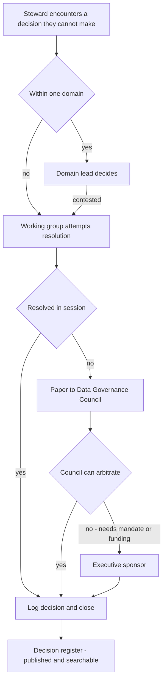

# Data Governance Operating Model

**Governance is not a document set. It is a small number of people with named decisions to make, meeting often enough to make them.**

Most operating models fail in the same way: they define twelve roles, four forums and a policy hierarchy, then discover that nobody's day changed. This document is about what people actually do on a Tuesday, how many of them you need, which decisions each forum owns, and how to stand the whole thing up in ninety days.

---

## 1. Roles: what each one genuinely does

Titles are cheap. The test for whether a role exists is: **can you name the decisions it makes, and would anyone notice if it stopped?**

### Data Owner

**Is:** a senior business leader accountable for a data domain. Not a data specialist — a person with authority over the business process that creates the data.

**Decides:** what the data means, who may access it, what quality level is acceptable, whether a definition change is approved, what happens when quality is not met.

**On a Tuesday:** approves or rejects a term definition change; signs off an access exception; is called when a quality breach affects a report they own; sets priority when two consumers want incompatible changes.

**Not:** a full-time role. Expect a few hours a month in steady state, more during stand-up. If the load exceeds a day a month, the domain is too big or too much is being escalated. **The test:** if the data owner cannot say no to a request from another business unit, they are not the owner.

### Data Steward — business

**Is:** the person who knows what the data *means* and who uses it. Usually sits in the business process, often a senior analyst or operations lead.

**Decides:** whether a definition is correct, whether a quality breach is real, what the remediation priority is, whether a proposed change breaks a consumer.

**On a Tuesday:** triages overnight quality breaches; drafts and reviews glossary terms; answers "where does this number come from" from three different people; sits in the working group; chases an upstream fix.

**Not:** a data engineer, and not the person who fixes the data — they decide what correct looks like. **Load:** the largest single time commitment in the model, typically 20–50% of one person per domain. Be honest about this in the business case.

### Data Steward — technical

**Is:** the engineer or platform specialist who knows where the data *is* and how it moves.

**Decides:** how a rule is implemented, whether lineage is captured correctly, what the technical remediation is, whether a schema change is safe.

**On a Tuesday:** implements and tunes quality rules; investigates why lineage broke; maps glossary terms to physical columns; assesses impact of a proposed schema change; fixes false positives.

**The split matters.** Merging business and technical stewardship into one role produces either a business person who cannot implement anything or an engineer defining business meaning. Both failure modes are common and both are expensive. Keep them separate and make them work as a pair.

### Data Custodian

**Is:** the team operating the platform where data physically lives — infrastructure, DBA, platform engineering.

**Decides:** how controls are technically enforced, backup and retention execution, encryption and key management, platform-level access mechanics.

**On a Tuesday:** provisions access as approved by the owner; executes retention jobs; maintains the platform; responds to incidents.

**Not:** an approver of who gets access. Custodians *execute* access decisions; owners *make* them. Blurring this is a standard audit finding.

### Domain Lead

**Is:** the coordinating role for a data domain — the operational counterpart to the data owner.

**Decides:** which issues in the domain get worked first, whether an issue escalates, who stewards what within the domain, domain-level roadmap.

**On a Tuesday:** runs the domain's part of the working group; unblocks stewards; negotiates with adjacent domains over shared entities; reports domain health upward. **Load:** typically 30–60% of a person for a substantial domain.

### Data Governance Lead

**Is:** the person who runs the function. Owns the framework, not the data.

**Decides:** the standards everyone follows, what the forums discuss, what gets escalated, how maturity is measured, where to invest scarce stewardship capacity.

**On a Tuesday:** chairs the working group; prepares council papers; resolves cross-domain definition disputes before they reach the council; maintains the policy set; produces the scorecard; spends a surprising amount of time persuading people.

**The trap:** becoming the person who does the governance rather than the person who makes governance happen. A governance lead who writes all the definitions has built a bottleneck with a job title.

### The CDO function

**Is:** the accountable executive and the small central team — governance lead, architecture, data quality, privacy liaison, and often the analytics or AI enablement function.

**Decides:** enterprise data strategy, investment allocation, which domains get support, arbitration of disputes the council cannot resolve, the risk appetite for data.

**Central versus federated:** the central team should own the framework, the tooling, the standards and the measurement. The domains own the data. A central team that owns the data becomes a queue; a federated model with no centre becomes a set of incompatible local practices. The workable shape is **thin centre, strong domains, common standards** — and the centre's real product is making the domains' work cheaper.

### Role summary

| Role | Accountable for | Time commitment (starting point) | Sits in |
|---|---|---|---|
| Data Owner | Meaning, access, quality standard | 2–8 hours/month | Business leadership |
| Business Steward | Correctness and priority | 0.2–0.5 FTE per domain | Business process |
| Technical Steward | Implementation and mapping | 0.2–0.5 FTE per domain | Engineering |
| Data Custodian | Platform execution of controls | Part of existing platform role | Platform / infrastructure |
| Domain Lead | Domain delivery and coordination | 0.3–0.6 FTE | Business or CDO |
| Governance Lead | The framework and the function | 1.0 FTE | CDO function |
| CDO | Strategy, investment, arbitration | Executive | Executive |

All figures are starting points. Calibrate from your domain count, regulatory load and data volume after one quarter of observation.

---

## 2. Sizing stewardship without creating bureaucrats

The instinct is to appoint one steward per system. Resist it. Stewardship scales with **contested meaning and consuming obligations**, not with table count.

### Size from demand, not from inventory

Estimate the recurring monthly work per domain:

| Activity | Rough driver | Starting estimate |
|---|---|---|
| Quality breach triage | Error-severity rules × breach rate | 15–30 min per breach |
| Glossary term drafting and review | New and changed terms | 1–2 hours per term |
| Access request review | Requests per month | 10 min per request |
| Issue investigation | Confirmed incidents | 2–8 hours per incident |
| Change impact assessment | Schema and definition changes | 1–3 hours per change |
| Forum attendance | Fixed | 4–6 hours per month |

Add it up. If it lands under 0.2 FTE, do not appoint a dedicated steward — attach the responsibility to an existing role and measure whether it gets done. If it lands over 0.6 FTE, split the domain or you will burn the person out.

### Four rules that keep stewards useful

1. **Stewardship is a responsibility, not usually a job.** Most effective stewards are senior practitioners doing governance as part of their role. Full-time stewards detached from the business process lose the knowledge that made them valuable.
2. **Never appoint a steward without removing something else.** A responsibility added to a full plate is a responsibility that will not be discharged. This is the single most-skipped step.
3. **Name individuals, not teams.** "The finance data team" cannot triage a breach. A person can.
4. **Give them a decision to make.** A steward who can only recommend will be routed around within a quarter.

### The capacity signal

Track quarantine age and open-issue age. When they trend up, you are out of stewardship capacity — not out of tooling and not out of process. Adding rules or policies at that point makes the situation worse.

---

## 3. Forum structure

Three tiers. Adding a fourth is how you get committees that exist to prepare for other committees.

| | **Data Working Group** | **Data Governance Council** | **Executive Sponsor / Data Board** |
|---|---|---|---|
| **Purpose** | Do the work. Resolve operational issues, review definitions, triage escalations | Set standards, arbitrate cross-domain disputes, approve policy, prioritise investment | Fund it, mandate it, remove blockers, hold the line when governance is inconvenient |
| **Membership** | Business and technical stewards, domain leads, governance lead (chair) | Data owners, domain leads, governance lead (chair), risk/privacy/compliance representation, CDO | CDO (chair), business unit executives, CRO or equivalent, CTO/CIO |
| **Cadence** | Weekly or fortnightly, 60 min | Monthly, 90 min | Quarterly, 60 min |
| **Decision rights** | Term approval within a domain; rule thresholds; issue priority within domain; remediation approach | Cross-domain term arbitration; policy approval; domain boundary changes; standards; exception approval; classification scheme changes | Investment; mandate and enforcement; escalations the council cannot resolve; risk appetite |
| **Inputs** | Issue queue, breach report, term queue, change requests | Working group escalations, scorecard, policy proposals, exception requests | Council escalations, quarterly scorecard, investment cases |
| **Outputs** | Decisions logged, actions with owners and dates | Approved standards, arbitration rulings, prioritised backlog | Mandate, funding, unblocked dependencies |
| **Quorum** | Half of domains represented | Data owners for affected domains, plus risk | Chair plus two business executives |
| **Fails when** | It becomes a status meeting | It reviews everything and decides nothing | It meets and nothing changes afterwards |

### Working group agenda that keeps it a working meeting

```text
1.  Actions overdue from last session                            5 min
2.  Breaches and incidents - by exception only, not a full read  15 min
3.  Terms awaiting decision - decide or escalate, no deferrals   15 min
4.  Change impact assessments needing steward input              10 min
5.  Escalations to council - agree the ask and the paper          10 min
6.  Round the table - blockers only                                5 min
```

**Two disciplines make this work.** Anything with no decision required goes in a pre-read, not the agenda. And every item is either decided or escalated in that session — "take it offline" is how items become permanent residents.

---

## 4. Escalation paths



Publish the time bounds so people can predict them. These are starting points:

| From | To | Trigger | Time bound |
|---|---|---|---|
| Steward | Domain lead | Cannot decide within domain | 2 working days |
| Domain lead | Working group | Cross-domain or contested | Next session |
| Working group | Council | Unresolved after one full session | Next council |
| Council | Executive | Needs mandate, funding or overrules a business unit | Next board, or ad hoc if material |
| Any level | Immediate executive | Regulatory exposure or client-impacting error | Same day |

**Escalation is not failure.** Say this repeatedly and demonstrate it, because the default culture reads escalation as an admission of incompetence and the result is unresolved items sitting in queues for months. Publishing escalation counts as a health metric — not a problem metric — is what changes the behaviour.

---

## 5. Recording decisions so they are findable

An unrecorded decision will be re-litigated. Reliably, within about six months, usually by someone who was in the room.

**Minimum decision record:**

```yaml
decision_id: DG-2026-041
date: "2026-04-14"
forum: Data Governance Council
title: Treatment of reinvested income in Net New Assets
decision: >
  Reinvested income and dividends are excluded from Net New Assets.
  Treatment must be disclosed alongside any published figure.
rationale: >
  Inclusion inflates the measure relative to external peer comparison and
  conflates client-driven movement with investment performance.
alternatives_considered:
  - Include as flow - rejected, breaks peer comparability
  - Disclose both - rejected, two headline figures confuse the audience
decided_by: Head of Investment Reporting
affected_domains: [Investment Management, Client]
affected_assets: [Net New Assets, Assets under Management]
supersedes: null                  # points at the decision this replaces
effective_from: "2026-07-01"
restates_history: false
review_by: "2027-04-14"
```

Rules that make a decision register usable:

- **One register, not one per forum.** Searchability is the whole value.
- **Link decisions to the assets they affect.** In a catalogue tool, attach the decision to the term or dataset so someone reading the term sees the ruling. Discovery at the point of use beats a well-organised archive nobody opens.
- **Record what was rejected and why.** This is what stops re-litigation.
- **Effective-date everything**, state whether history restates, and **never edit a decision** — supersede it with a new one that points back at what it replaced.

---

## 6. The domain model

Domains are the unit of ownership. Carve them wrong and everything downstream — RACI, glossary routing, quality accountability — inherits the flaw.

### Three carving strategies

| Approach | Domains look like | Strengths | Weaknesses | Fits when |
|---|---|---|---|---|
| **By business function** | Distribution, Investment Management, Finance, Risk, Operations, HR | Maps to real org authority; owners have genuine power; budget aligns | Shared entities land in two places; reorganisations break it | The org is stable and functions are clearly bounded |
| **By subject area** | Client, Product, Transaction, Position, Employee, Reference | Follows the data's natural shape; survives reorganisation; matches how models are built | Owners must be *assigned* rather than being naturally accountable; can feel abstract to the business | Data is highly shared across functions |
| **By system** | Core platform, CRM, warehouse, reporting layer | Easy to start; owners are obvious; maps to existing support teams | **Guarantees the same concept is governed differently in each system.** Dies at the first migration | Never as a target state. Acceptable only as a temporary bridge |

### What usually works

A **subject-area domain model with functional owners**. The domain is *Client*; the owner is whoever leads the function with the strongest legitimate claim — typically the one that creates the data rather than the one that consumes most of it. You get durability from the subject-area shape and authority from the functional appointment.

### Sizing and boundaries

- **6–12 top-level domains** for a large organisation is a workable starting point. Fewer and ownership is too diffuse; more and you cannot convene a council.
- **Subdomains** where a domain is too big to steward — *Client* splitting into *Client Identity*, *Client Agreement*, *Client Contact*.
- **Every dataset belongs to exactly one domain.** Shared datasets are the single largest source of ownership ambiguity. Assign one owner and give the other domains a formal consultation right.

### The shared-entity problem

*Client* is used by distribution, operations, finance and risk, each with a legitimate view. Do not create four client domains. Instead:

1. One owning domain for the entity.
2. Named consulting domains with a formal right to be consulted on definition changes.
3. Where a consuming domain genuinely needs a different concept, it gets its own **term** (*Engaged Client*), not its own **domain**.

That third point resolves most turf disputes. The argument is almost never about ownership — it is about someone's legitimate concept being suppressed.

---

## 7. Ninety-day stand-up plan

Assumes an executive sponsor exists and one domain has agreed to go first. If neither is true, weeks 1–2 are about securing them, and everything shifts.

Six phases, five activities each. Copy the list and work it.

- [ ] **W1–2 · mandate and scope** — confirm the executive sponsor in writing, with a stated mandate
- [ ] **W1–2** — choose **one** pilot domain with a real, visible pain point
- [ ] **W1–2** — draft the domain model; a whiteboard version, not a final one
- [ ] **W1–2** — inventory the executive reporting pack, the input to glossary seeding
- [ ] **W1–2** — agree what success looks like at day 90, in one sentence
- [ ] **W3–4 · roles and forums** — name the data owner for the pilot domain and get their agreement
- [ ] **W3–4** — name business and technical stewards; **remove something from their plate**
- [ ] **W3–4** — stand up the working group; hold session one
- [ ] **W3–4** — create the decision register and log the domain model decision as DG-001
- [ ] **W3–4** — publish the escalation path
- [ ] **W5–6 · first artefacts** — extract the top 20 metrics from the reporting pack
- [ ] **W5–6** — derive the seed noun list, expect 25–40 terms
- [ ] **W5–6** — draft the first 10 terms; publish as `proposed`
- [ ] **W5–6** — identify 5 critical data elements in the pilot domain
- [ ] **W5–6** — deploy 5–10 quality rules at `info` severity, measuring only
- [ ] **W7–8 · council and first friction** — council session one approves the domain model and term standard
- [ ] **W7–8** — run the first cross-domain term dispute through the working group deliberately
- [ ] **W7–8** — map each `proposed` term to at least one physical column
- [ ] **W7–8** — stand up the issue register; log the first real issue
- [ ] **W7–8** — baseline the quality rules; record the observed pass rates
- [ ] **W9–10 · exercise the machinery** — escalate one item to council on purpose and publish the outcome
- [ ] **W9–10** — approve the first cohort of terms
- [ ] **W9–10** — run one full remediation loop end to end, including an upstream fix
- [ ] **W9–10** — draft the RACI for glossary and quality lifecycles
- [ ] **W9–10** — produce the first scorecard, even if the numbers are poor
- [ ] **W11–12 · prove and extend** — promote 2–3 rules to `error` with thresholds derived from observation
- [ ] **W11–12** — present the scorecard to the sponsor with a baseline, not a target
- [ ] **W11–12** — agree domain two and name its owner
- [ ] **W11–12** — write down what did not work, honestly, in the decision register
- [ ] **W11–12** — get the sponsor to reconfirm the mandate for the next quarter

### What "done" looks like at day 90

Not a mature function. You should have: one domain with a named owner who has made a real decision; 15–25 approved terms with physical mappings; 5–10 rules measuring with observed baselines; a working group that has met six times and logged decisions; one exercised escalation; one completed remediation loop; and a scorecard with a baseline. **If you have all of that, you have a functioning governance loop at small scale, and scaling is a resourcing problem.** If you have a framework document and a policy set but none of the above, you have documentation theatre — see below.

---

## 8. Failure modes

### Documentation theatre

**Looks like:** a policy hierarchy, a framework diagram, a 60-page charter, a maturity assessment. No decisions logged. No rule has ever quarantined anything. **Why it happens:** documents are the easiest thing to produce and the easiest thing to show a steering committee. They demonstrate effort without requiring anyone to change behaviour.

**Fix:** for every policy, name the control that enforces it and the evidence it produces. If neither exists, the policy is a wish. Delete it or build the control.

### The steward who is a name on a slide

**Looks like:** a role assigned in a workshop, never mentioned again. The person may not know. Their manager certainly does not. **Why it happens:** the appointment was made to fill a box on a target operating model, not to discharge work.

**Fix:** every steward has a queue with their name on it and a response SLA. Report per-steward throughput to their line manager. A steward with an empty queue for a quarter is either not needed or not engaged — find out which.

### Councils that review everything and decide nothing

**Looks like:** two-hour meetings, thirty-slide packs, "noted" as the most common outcome, the same items recurring for months. **Why it happens:** no defined decision rights, no quorum discipline, and papers that inform rather than ask.

**Fix:** every paper states the decision requested in its first line. Items with no decision go to a pre-read. Publish the decision count per session — if it is zero twice running, cancel the forum and rebuild it.

### Policies with no control behind them

**Looks like:** "All critical data elements must have an assigned owner." Nobody knows how many exist, who owns them, or what happens if one does not. **Why it happens:** policy is cheap and control is expensive, so the policy ships and the control is deferred.

**Fix:** each policy statement carries a control reference, an owner, a measurement, and a consequence. If you cannot fill all four, downgrade it to guidance and be honest about what it is.

### Two more worth naming

- **Tool-led governance.** The platform is procured before the operating model exists. The tool then dictates the model, badly, and the programme becomes a deployment project. Buy the tool once you know what decisions you are making.
- **The perfect domain model.** Six months designing domains before governing anything. Publish a rough model in week 2 and correct it in month 6 with evidence.

---

## 9. Maturity ladder

Observable behaviours, not adjectives. Assess against what you can **see** — a decision register you can open, a rule you can watch fire. If an assessor cannot verify a level by looking at an artefact, you have not reached it.

### Level 1 — Absent

- No named owners for any data domain
- Definitions live in individuals' heads; the same metric is reported differently by different teams and nobody reconciles them
- Data issues are found by consumers, usually in a meeting, usually in front of someone senior
- Quality is discussed only after an incident
- No record exists of who decided what

### Level 2 — Reactive

- Owners named for some domains, mostly on a slide
- A glossary exists; it is a spreadsheet; it is out of date
- Quality checks exist inside individual pipelines, written by engineers, unknown to the business
- Issues are tracked in a list; root cause is rarely established; fixes are downstream patches
- A forum meets irregularly and produces status updates rather than decisions

### Level 3 — Defined

- Every domain has a named owner who has made at least one decision that was recorded and honoured
- Glossary terms have owners, statuses and a working approval workflow; executive-report metrics are covered
- Quality rules are catalogued with owners, severities and thresholds derived from observation
- Issues have a register, an SLA and a triage process; root cause is recorded
- Working group and council meet on cadence with published decision rights
- Lineage exists for the critical reporting paths
- A scorecard is produced and shown to the sponsor

### Level 4 — Managed

- Changes to definitions and schemas trigger impact analysis **before** approval, and the analysis is evidenced
- Quality rules gate publication; breaches quarantine and are triaged within SLA
- Upstream fixes outnumber downstream patches over a rolling quarter
- Access is granted against classification with periodic recertification that actually removes entitlements
- Lineage is a by-product of the pipeline and is used routinely for impact analysis, not just for audit
- The scorecard drives investment decisions; targets are baseline-derived
- Stewardship load is measured and staffed accordingly

### Level 5 — Optimising

- Governance metadata is consumed programmatically — pipelines read classification and enforce it; agents read the glossary for grounding
- New data products are governed at design time; ungoverned products cannot reach production
- Quality thresholds are re-derived automatically from observed distributions and reviewed by exception
- The function measures its own cost and demonstrably reduces it year on year
- Domains self-govern to a common standard; the centre arbitrates rather than executes
- Governance failures are treated as system failures with blameless post-incident review

### Using the ladder honestly

- **Assess per domain, not per enterprise.** An enterprise average hides everything useful. One domain at level 4 and six at level 2 is a completely different situation from all seven at level 3.
- **Most organisations plateau between 2 and 3**, because level 3 requires sustained stewardship capacity rather than a project.
- **Do not target level 5 everywhere.** It is not worth the cost for a low-risk domain. Target level 4 for regulatory and client-facing domains and level 3 for the rest, and say so explicitly — an honest differentiated target is more credible than a uniform aspiration.
- **Progression is roughly a year per level** with sustained investment. Anyone promising level 4 in six months is selling something.

---

## Related

- [`raci-template.md`](raci-template.md) — the activity-level RACI matrices for these roles
- [`../glossary/business-glossary-template.md`](../glossary/business-glossary-template.md) — the glossary workflow this model approves
- [`../quality/dq-rule-catalogue.md`](../quality/dq-rule-catalogue.md) — the rules stewards own and triage
- [`../metrics/cdo-kpi-framework.md`](../metrics/cdo-kpi-framework.md) — measuring whether any of this is working
