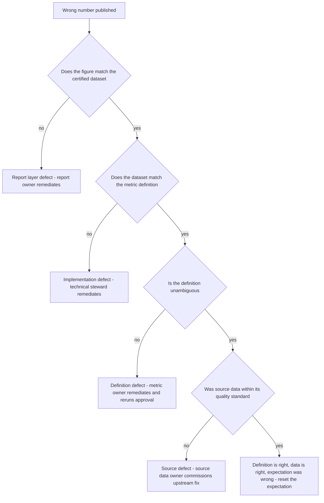

# RACI Template for Data Governance Activities

**A RACI is only useful if it settles an argument you are actually having.**

Most published RACIs do not. They assign every role to every activity, mark half the organisation as Consulted, and put an A next to a committee that has never made a decision. This document gives you eight filled-in matrices for the activities a governance function genuinely performs, the rules that keep them honest, and a worked resolution of the dispute that comes up more than any other.

---

## 1. RACI in one paragraph, and its failure mode

**R — Responsible:** does the work. Can be several people.
**A — Accountable:** owns the outcome and makes the decision. **Exactly one per activity.** Has the authority to say no.
**C — Consulted:** two-way. Their input is sought before the decision and they can object.
**I — Informed:** one-way. Told after the fact. No veto, no delay.

### The failure mode

The classic collapse is **everyone Consulted, nobody Accountable**. It happens for a predictable reason: marking a stakeholder as Consulted is diplomatically free, whereas telling someone they are merely Informed requires a conversation. So the C column fills up, the A column gets assigned to a forum to avoid naming an individual, and the result is an activity that requires eight sign-offs and has no decider. The process then takes six weeks, people route around it, and within two quarters the RACI is a document nobody opens.

Three symptoms that your RACI has already collapsed:

- More than three Cs on a routine activity
- An A assigned to a committee, a team, or a function rather than a role held by a person
- The same role marked both A and R on more than half of all rows

**The discipline that prevents it:** default every stakeholder to Informed and require a stated reason to promote them to Consulted. The reason must be "they can veto this on these grounds", not "they would like to know".

---

## 2. Role legend

Columns are consistent across every matrix below, using the roles from [`operating-model.md`](operating-model.md).

| Code | Role | Authority in one line |
|---|---|---|
| **DO** | Data Owner | Senior business leader; can say no on behalf of the domain |
| **DL** | Domain Lead | Coordinates the domain; prioritises within it |
| **BS** | Business Steward | Decides what correct means; triages |
| **TS** | Technical Steward | Implements, maps, assesses technical impact |
| **DC** | Data Custodian | Operates the platform; executes controls |
| **GL** | Data Governance Lead | Owns the framework and the standard |
| **RP** | Risk, Privacy and Compliance | Regulatory and privacy veto |
| **CDO** | Chief Data Officer function | Strategy, arbitration, investment |

---

## 3. Glossary term lifecycle

| Activity | DO | DL | BS | TS | DC | GL | RP | CDO |
|---|---|---|---|---|---|---|---|---|
| Identify need for a new term | I | C | **A/R** | C | – | I | – | – |
| Check for duplicates and near-misses | – | I | **A/R** | C | – | C | – | – |
| Draft the definition | C | I | **A/R** | C | – | C | – | – |
| Assign sensitivity classification | C | I | R | I | – | C | **A** | – |
| Map term to physical columns | – | I | C | **A/R** | I | – | – | – |
| Review against writing standard | – | – | R | – | – | **A** | – | – |
| Circulate to affected domains | – | R | R | – | – | **A** | I | – |
| Raise an objection during circulation | C | C | C | C | – | I | C | – |
| Reconcile a cross-domain objection | C | **A/R** | R | C | – | C | I | – |
| Approve the term | **A** | R | C | C | – | C | C | I |
| Arbitrate an unresolved dispute | C | C | I | I | – | R | C | **A** |
| Publish the approved term | – | I | I | I | – | **A/R** | – | – |
| Propose a scope change | C | C | **A/R** | C | – | I | – | – |
| Perform impact analysis on change | I | C | R | **A/R** | I | C | I | – |
| Approve a scope change | **A** | R | C | C | – | C | C | I |
| Deprecate a term | **A** | R | R | C | – | C | I | – |
| Annual re-attestation | **A** | R | R | I | – | C | – | I |
| Report overdue attestations | I | I | I | – | – | **A/R** | – | I |

**Note the two As on impact analysis.** The business steward is accountable for the *business* impact list, the technical steward for the *technical* one. Where an activity genuinely has two separable outcomes, split the row rather than fudging a shared A — that is the honest fix.

---

## 4. Data quality rule lifecycle

| Activity | DO | DL | BS | TS | DC | GL | RP | CDO |
|---|---|---|---|---|---|---|---|---|
| Identify a control need | C | C | **A/R** | C | – | I | C | – |
| Select a catalogue pattern | – | I | C | **A/R** | – | C | – | – |
| Define the rule expression | – | I | C | **A/R** | – | – | – | – |
| Set the observation period | – | I | **A/R** | C | – | C | – | – |
| Deploy rule at info severity | – | I | I | **A/R** | C | I | – | – |
| Analyse observed baseline | – | I | **A/R** | R | – | C | – | – |
| Correct the rule after baseline | – | I | C | **A/R** | – | – | – | – |
| Set the threshold | C | I | **A/R** | C | – | C | – | – |
| Set the severity | **A** | C | R | C | – | C | C | – |
| Confirm the response SLA | **A** | R | C | I | – | C | – | – |
| Approve promotion to enforced | **A** | R | R | C | I | C | C | – |
| Implement quarantine behaviour | – | I | I | R | **A** | – | – | – |
| Monitor rule execution | – | I | I | **A/R** | C | I | – | – |
| Triage a breach | – | I | **A/R** | C | – | I | – | – |
| Fix a false positive | – | I | C | **A/R** | – | – | – | – |
| Re-derive threshold at review date | – | I | **A/R** | R | – | C | – | – |
| Retire a rule | **A** | R | R | R | I | C | – | – |
| Report rule coverage of critical elements | I | I | I | I | – | **A/R** | I | I |

---

## 5. Data issue management

| Activity | DO | DL | BS | TS | DC | GL | RP | CDO |
|---|---|---|---|---|---|---|---|---|
| Detect a candidate issue | I | I | R | R | R | I | – | – |
| Raise an issue record | – | I | **A/R** | R | R | I | – | – |
| Triage: real defect or false positive | – | I | **A/R** | C | – | – | – | – |
| Assess business impact and severity | C | C | **A/R** | C | – | I | C | – |
| Notify affected consumers | I | R | **A/R** | I | – | C | I | – |
| Assess regulatory reportability | C | I | C | – | – | C | **A/R** | I |
| Prioritise against other issues | C | **A/R** | R | C | – | I | C | – |
| Investigate root cause | – | I | R | **A/R** | C | – | – | – |
| Agree the remediation approach | **A** | R | R | R | C | C | C | – |
| Apply a downstream tactical fix | – | I | C | **A/R** | C | I | I | – |
| Commission the upstream fix | **A** | R | C | C | I | I | – | I |
| Reprocess affected data | – | I | C | R | **A** | – | – | – |
| Verify remediation | – | I | **A/R** | R | I | – | C | – |
| Close the issue | **A** | R | R | I | – | I | I | – |
| Escalate a breached SLA | – | R | R | – | – | **A** | I | I |
| Report issue trends and ageing | I | I | I | – | – | **A/R** | I | I |
| Track downstream-patch to upstream-fix ratio | I | C | I | I | – | **A/R** | – | I |

**The row that carries the most weight is "Commission the upstream fix".** It sits with the data owner because it usually requires spending someone else's budget in someone else's system. A steward has no authority to do that, and a RACI that pretends otherwise is why upstream fixes never happen.

---

## 6. Metadata and lineage maintenance

| Activity | DO | DL | BS | TS | DC | GL | RP | CDO |
|---|---|---|---|---|---|---|---|---|
| Define the metadata standard | – | C | C | C | C | **A/R** | C | I |
| Register a dataset in the catalogue | – | I | C | **A/R** | C | I | – | – |
| Assign dataset ownership | **A** | R | I | I | – | C | – | I |
| Populate business descriptions | I | I | **A/R** | C | – | C | – | – |
| Assign classification to a dataset | C | I | R | C | – | C | **A** | – |
| Configure automated lineage harvesting | – | I | – | R | **A** | C | – | – |
| Validate harvested lineage accuracy | – | I | C | **A/R** | C | I | – | – |
| Declare manual lineage where harvesting cannot reach | – | I | C | **A/R** | I | C | – | – |
| Certify a dataset as fit for use | **A** | R | R | C | – | C | C | – |
| Detect and report lineage gaps | – | I | I | R | C | **A** | – | I |
| Maintain lineage after a pipeline change | – | I | I | **A/R** | C | I | – | – |
| Retire catalogue entries for decommissioned assets | C | **A** | I | R | R | I | – | – |
| Review catalogue coverage | I | C | I | I | – | **A/R** | I | I |

---

## 7. Access request and entitlement review

| Activity | DO | DL | BS | TS | DC | GL | RP | CDO |
|---|---|---|---|---|---|---|---|---|
| Define the access model for a domain | **A** | R | C | C | C | C | C | I |
| Submit an access request | – | – | – | – | – | – | – | – |
| Verify business justification | C | R | **A/R** | – | – | – | – | – |
| Check classification and handling rules | – | I | C | – | – | C | **A/R** | – |
| Approve standard access | **A** | R | C | – | I | – | I | – |
| Approve access to restricted data | **A** | C | C | – | I | I | **C** | I |
| Approve a policy exception | C | C | I | I | I | R | C | **A** |
| Provision the entitlement | – | I | I | I | **A/R** | – | – | – |
| Log the grant with justification | – | – | – | – | **A/R** | C | C | – |
| Run periodic recertification campaign | I | R | R | – | C | **A** | C | I |
| Attest that access remains required | **A** | R | C | – | I | I | – | – |
| Revoke unattested entitlements | I | I | I | – | **A/R** | C | I | – |
| Revoke on leaver or role change | I | I | I | – | **A/R** | I | C | – |
| Report entitlement drift and stale access | I | I | I | – | C | **A/R** | C | I |

**"Submit an access request" has no assignments on purpose.** The requester is outside the governance role set — any employee can ask. Filling that row with roles is how a RACI starts describing a workflow rather than accountability. Leave it, and let it prompt the question.

**Recertification only counts if it removes access.** A campaign where 99% of entitlements are re-attested is a rubber stamp. Publish the revocation rate alongside the completion rate, and be suspicious of a low one.

---

## 8. Reference and master data change

| Activity | DO | DL | BS | TS | DC | GL | RP | CDO |
|---|---|---|---|---|---|---|---|---|
| Define the golden source for an entity | **A** | R | C | C | I | C | – | I |
| Request a new reference code value | – | I | R | C | – | – | – | – |
| Assess downstream impact of a new value | – | I | C | **A/R** | I | – | – | – |
| Approve a new code value | C | **A** | R | C | – | I | – | – |
| Approve a change to code meaning | **A** | R | R | C | – | C | C | – |
| Retire a code value | **A** | R | R | C | I | I | – | – |
| Define matching and survivorship rules | C | **A** | R | R | – | C | C | – |
| Approve a manual merge of duplicates | – | C | **A/R** | R | – | – | – | – |
| Approve an unmerge or split | **A** | R | R | R | – | I | – | – |
| Maintain cross-reference mappings | – | I | C | **A/R** | C | – | – | – |
| Publish reference data to consumers | – | I | I | R | **A** | – | – | – |
| Notify consumers of a breaking change | – | R | R | R | I | **A** | – | I |
| Version and effective-date the change | – | I | C | **A/R** | C | C | – | – |
| Arbitrate golden-source disputes | C | C | I | I | I | R | – | **A** |

**Changing the meaning of an existing code is a breaking change**, even though nothing in the schema moves. It is far more dangerous than adding a value, because every downstream consumer keeps working and quietly produces different answers. Route it through the same approval as a glossary scope change.

---

## 9. New data source onboarding

| Activity | DO | DL | BS | TS | DC | GL | RP | CDO |
|---|---|---|---|---|---|---|---|---|
| Submit an onboarding request | – | R | C | C | – | I | – | – |
| Confirm a genuine business need | **A** | R | C | – | – | I | – | – |
| Check for an existing equivalent source | – | C | C | R | – | **A** | – | – |
| Assess licensing and redistribution terms | C | C | I | I | – | R | **A** | I |
| Assess privacy and lawful basis | C | I | C | I | – | C | **A/R** | I |
| Classify the incoming data | C | I | R | C | – | C | **A** | – |
| Assign the owning domain | C | C | I | I | – | **A/R** | – | I |
| Name owner and stewards for the source | **A** | R | I | I | – | C | – | I |
| Design ingestion and target model | – | I | C | **A/R** | C | C | – | – |
| Define minimum quality rules before go-live | C | I | **A/R** | R | – | C | C | – |
| Register in the catalogue with lineage | – | I | C | **A/R** | C | C | – | – |
| Define retention from day one | C | I | C | R | R | C | **A** | – |
| Approve go-live | **A** | R | C | C | C | C | C | I |
| Post-implementation review | I | **A/R** | R | R | I | C | I | – |

**Do not let a source go live without a named owner, a classification and a retention rule.** These three are almost free at onboarding and extremely expensive to retrofit — retrofitting retention in particular means reconstructing the lawful basis for data you have already collected. Make them gating criteria, and enforce the gate at least once publicly so people believe it.

---

## 10. Data retention and archival

| Activity | DO | DL | BS | TS | DC | GL | RP | CDO |
|---|---|---|---|---|---|---|---|---|
| Define the retention schedule | C | C | C | I | I | R | **A** | I |
| Map datasets to retention categories | C | R | R | **A/R** | C | C | C | – |
| Determine the retention trigger event | C | I | **A/R** | C | – | C | C | – |
| Approve a retention exception | C | C | I | I | I | R | **A** | I |
| Apply a legal hold | I | I | I | R | R | I | **A/R** | I |
| Release a legal hold | I | I | I | R | R | I | **A/R** | I |
| Execute scheduled deletion | – | I | I | C | **A/R** | I | C | – |
| Verify deletion completed, including copies | – | I | I | R | R | C | **A** | – |
| Archive data leaving active use | – | C | C | R | **A/R** | I | C | – |
| Confirm archived data remains readable | – | I | I | R | **A** | I | C | – |
| Decommission a dataset | **A** | R | C | R | R | C | C | – |
| Confirm no downstream consumers remain | – | C | C | **A/R** | I | C | – | – |
| Evidence retention compliance to audit | I | I | I | I | C | R | **A** | I |

**"Verify deletion completed, including copies" is the row that fails audits.** Production deletion is straightforward; the backups, the extracts, the analytics sandbox copies and the spreadsheet on someone's drive are what remain. If you cannot enumerate the copies, you cannot evidence deletion — which makes lineage a retention control, not just an impact-analysis tool.

---

## 11. Rules for making a RACI stick

1. **Exactly one A per row.** If you need two, the activity is two activities. Split it.
2. **The A must have authority to decide.** Not to recommend, not to coordinate — to decide, including deciding no. If the named role would have to ask someone else, that someone else is the A.
3. **Never assign A to a committee.** Committees advise and ratify; individuals decide. "The council" as an A means nobody.
4. **Cap Consulted at three.** Beyond three, the activity cannot complete in a working week. Demote the rest to Informed.
5. **A C must be able to object on stated grounds.** If they cannot block anything, they are Informed. This is the single biggest source of RACI bloat.
6. **R without A is fine; A without R is fine.** An accountable owner who does none of the work is normal and healthy.
7. **Assign to roles, not names.** Names change. Maintain the role-to-person mapping separately, in one place.
8. **Review when the org changes.** A reorganisation invalidates a RACI silently — the boxes still look right while the authority behind them has moved. Trigger a review on any change to the domain model, any owner change, and at least annually.
9. **Publish it where the work happens.** A RACI in a slide deck is decoration. Attach it to the workflow, the catalogue asset, or the issue type so it is visible at the point of the decision.
10. **Test it with a real dispute.** An untested RACI is a hypothesis. Run a live disagreement through it and see whether the named A actually decides.

---

## 12. Worked example: the executive report number is wrong

**The situation.** A figure on the monthly executive pack is wrong. Three roles are in the room and each has a defensible claim that it is not theirs.

- The **report owner** says they published what the certified dataset gave them.
- The **metric owner** says the definition is correct and unchanged.
- The **pipeline owner** says the job ran green and matched the source.

Everyone is right about their own scope, which is exactly why this stalls.

### Resolve it by separating four distinct accountabilities

| Question | Accountable | Why |
|---|---|---|
| Is the **number** correct as published? | **Report owner** | They published it. Accountability for the artefact sits with whoever put it in front of the executive |
| Is the **definition** correct and unambiguous? | **Metric owner** | They own what the number means |
| Was the **data** produced correctly against that definition? | **Pipeline owner** (technical steward) | They own the implementation |
| Was the **source data** fit for use? | **Data owner** of the source domain | They own the quality standard at origin |

**The report owner is accountable for the published figure. Always.** They are not necessarily at fault, and that distinction is what makes this workable. Accountability for the artefact and fault for the defect are different things — conflating them is what drives the defensive behaviour that stalls the investigation in the first place.

### Then find fault by walking the chain



### How it actually played out

The figure matched the certified dataset. The dataset matched the definition. The definition said "Active Client" without stating which of the two readings applied. The report had used the operational reading; the executive audience had assumed the commercial one.

**Nobody built anything wrong.** The defect was an ambiguous definition that had passed approval without a `not_to_be_confused_with` entry.

**Outcome:**

- Report owner: publishes a correction with a footnote stating which reading applies. Accountable for the artefact, so accountable for the correction.
- Metric owner: adds the disambiguation and the counter-example to the term; the term goes back through approval. Accountable for the definition defect.
- Technical steward: adds a rule asserting the report's figure reconciles to the certified dataset — so that next time, step one of the chain is answered automatically.
- Governance lead: logs the decision; adds "ambiguity check against near-miss terms" to the term review standard so the class of defect is closed, not just the instance.

### The generalisable point

Two rows that look like one:

| Activity | Accountable |
|---|---|
| Publish a correct figure | Report owner |
| Remediate the defect causing an incorrect figure | Whoever owns the layer where the defect originated |

Write both rows into your RACI. Almost every "who is accountable" dispute in reporting dissolves once those two are separated — the argument was never really about accountability, it was about blame.

---

## 13. Blank template

```markdown
## RACI: <activity set name>

Roles: DO = Data Owner | DL = Domain Lead | BS = Business Steward
       TS = Technical Steward | DC = Data Custodian | GL = Governance Lead
       RP = Risk, Privacy and Compliance | CDO = Chief Data Officer function

| Activity | DO | DL | BS | TS | DC | GL | RP | CDO |
|---|---|---|---|---|---|---|---|---|
| <activity 1> |  |  |  |  |  |  |  |  |
| <activity 2> |  |  |  |  |  |  |  |  |
| <activity 3> |  |  |  |  |  |  |  |  |

Checks before publishing:
- [ ] Exactly one A on every row
- [ ] Every A is a role a person holds, not a committee
- [ ] Every A could say no and make it stick
- [ ] No row has more than three Cs
- [ ] Every C can object on stated grounds
- [ ] Activities are verbs with an outcome, not topics
- [ ] Reviewed against the current domain model
- [ ] Owner of this matrix: <role>   Next review: <date>
```

### Writing good activity rows

| Poor row | Why it fails | Better |
|---|---|---|
| "Data quality" | A topic, not an activity | "Set the threshold for a quality rule" |
| "Governance oversight" | No outcome; nobody can be accountable for it | "Approve promotion of a rule to enforced" |
| "Manage the glossary" | Too coarse; hides a dozen decisions | "Approve a term scope change" |
| "Support the business" | Unfalsifiable | "Respond to a term interpretation query within 2 days" |

An activity row should be a **verb plus an object plus an outcome someone could confirm happened**. If you cannot tell from the row whether it was done last month, rewrite it.

---

## Related

- [`operating-model.md`](operating-model.md) — the roles, forums and decision rights these matrices assume
- [`../glossary/business-glossary-template.md`](../glossary/business-glossary-template.md) — the term lifecycle in §3
- [`../quality/dq-rule-catalogue.md`](../quality/dq-rule-catalogue.md) — the rule lifecycle in §4
- [`../metrics/cdo-kpi-framework.md`](../metrics/cdo-kpi-framework.md) — measuring whether the accountabilities are discharged
